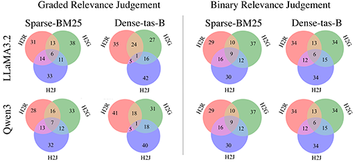
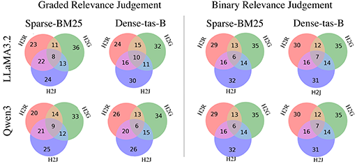

# Failing Forward: Understanding Query Failure in Retrieval, Judgment, and Generatio

This repo contains the code for the paper "Failing Forward: Understanding Query Failure in Retrieval, Judgment, and Generatio".

## Results for two main LLMs for Judgement
| Qwen3:8b             |  LlaMa3.2:latest |
:-------------------------:|:-------------------------:
 | 

## Metrics Explained

### NDCG@10
Normalized Discounted Cumulative Gain at rank 10 (NDCG@10) is a ranking metric that measures the quality of search results. It considers both the relevance of documents and their positions in the result list:
- Values range from 0.0 to 1.0, with 1.0 being perfect ranking
- Gives higher weight to relevant documents appearing earlier in the results
- The @10 indicates that only the top 10 retrieved documents are considered
- Used in our Hard to Retrieve analysis to evaluate retrieval effectiveness

### Quantile Threshold
A statistical measure used to identify hard queries by setting a performance threshold:
- We use the 0.3 quantile (30th percentile) as our threshold
- Queries with performance below this threshold are considered "hard"
- This approach allows us to objectively identify challenging queries across different datasets and models
- The lower band in our tables represents this 0.3 quantile threshold

### Hard Queries
Queries that are particularly challenging for systems to process effectively:
- **Hard to Retrieve (H2R)**: Queries where retrieval systems struggle to find relevant documents (NDCG@10 below the 0.3 quantile threshold)
- **Hard to Generate (H2G)**: Queries where generative models struggle to produce accurate or relevant responses (BERTScore below the 0.3 quantile threshold with the annotated passage in MSMarco[v1,v2])
- **Hard to Judge (H2J)**: Queries where determining grading or binary relevance between query and document is challenging for automated systems with human annotations

### BERTScore
A neural metric for evaluating text generation quality by computing similarity between generated and reference texts:
- Uses contextual embeddings from BERT to compute similarity
- F1 scores range from 0.0 to 1.0, with higher values indicating better quality


## Failure Reasons Analysis

The table below summarizes the key reasons for query failures across the three dimensions we studied:

| Category | Failure Reasons |
|----------|----------------|
| **Hard to Judge (H2J)** | • Quantitative data needed<br>• Specific and niche topic<br>• Query unrelated to provided criteria<br>• No relevant passage context |
| **Hard to Generate (H2G)** | • Up-to-date information needed<br>• Technical accuracy required<br>• Risk of misinformation |
| **Hard to Retrieve (H2R)** | • Numerical data extraction<br>• Specific product term<br>• Ambiguous subject reference |

### Example Queries and Their Hardness Aspects

The table below shows examples of queries and which aspects make them hard:

| Query ID | Query | Hard to Retrieve (H2R) | Hard to Generate (H2G) | Hard to Judge (H2J) |
|----------|-------|------------------------|------------------------|---------------------|
| 390360 | ia suffix meaning | DistilBert | Llama + Qwen | Graded |
| 673670 | what is a aim | BM25 | LLama | Graded |
| 555530 | what are best foods to lower cholesterol | Bm25 | Qwen | Graded |
| 443396 | lps laws definition | hard in binary all | LLaMa + Qwen | Binary |
| 121171 | define etruscans | DistilBert | LLaMa + Qwen | Binary |
| 1108651 | what the best way to get clothes white | BM25 | LLaMa | Binary |
| 1129560 | accounting definition of building improvements | Bm25 | Qwen | Binary |

## Repository Structure

```
paper_repo/
├── README.md
├── h2r_hard_queries.py         # Hard to Retrieve queries script
├── h2g_generate_passage.py     # Hard to Generate queries script
├── h2j_judgement_binary.py     # Hard to Judge (Binary) script
├── h2j_umbrela_like_llm_judge.py # Hard to Judge (Umbrela-like) script
├── pairwise_judge.py           # Pairwise judge evaluation
├── bertscore.py                # BERT score evaluation
├── find_reasons.py             # Analysis of failure reasons
├── bert_score_outputs/         # Outputs from BERT score evaluations
├── binary_judge/              # Binary judge evaluation outputs
├── conf_matrix/               # Confusion matrix results
├── datasets/                  # Query datasets and evaluation data
├── generated_queries/         # Generated query outputs
├── hard_to_retrieve/          # Hard to retrieve query analysis
│   ├── results/               # Results of hard to retrieve analysis
│   └── runs/                  # Run files for retrieval evaluation
├── modified_qrels/            # Modified relevance judgments
├── pairwise_llm_as_judege/    # Pairwise LLM judge outputs
├── reasoning_by_llm/          # LLM reasoning analysis
└── umbrela/                   # Umbrela framework implementation
    ├── prompts/               # Prompts for LLM evaluation
    └── utils/                 # Utility functions for Umbrela
```

## Setup

```bash
pip install -r requirements.txt
```

## [Hard to Retrieve](hard_to_retrieve/readme.md)

With this script we can find the hard to retrieve queries for a given run file.
It returns the quantile threshold for each dataset and save hard queries for each dataset (results below)

```bash
python h2r_hard_queries.py \
--run_file_path hard_to_retrieve/runs/run.msmarco-v2-passage.bm25-default.dl21.txt \
--qrel_file_path datasets/qrels.dl21-passage.txt \
--quantile 0.3 \
--output hard_to_retrieve/results/h2r_hard_to_retrieve_dl21.csv
```

The table below shows the retrieval performance across different datasets. The lower band represents the 0.3 quantile threshold, which we use to identify hard-to-retrieve queries.

| Dataset | Model | Mean NDCG | Lower Band (0.3 Quantile) |
|---------|-------|-----------|---------------------------|
| DL19 | BM25 | 0.246 | 0.426 |
| DL19 | DistilBERT-TAS-B | 0.485 | 0.641 |
| DL20 | BM25 | 0.223 | 0.365 |
| DL20 | DistilBERT-TAS-B | 0.518 | 0.616 |
| DL21 | BM25 | 0.201 | 0.336 |
| DL21 | DistilBERT-TAS-B | 0.119 | 0.256 |
| DL22 | BM25 | 0.108 | 0.189 |
| DL22 | DistilBERT-TAS-B | 0.140 | 0.242 |

## [Hard to Generate](generate_passage/readme.md)

With this script we can find the hard to generate queries for a given run file.

```bash
python h2g_generate_passage.py \
--queries datasets/test2021-queries-filterd.tsv \
--output h2g_generate_passage_outputs/h2g_generate_passage_dl21.json \
--model qwen3:8b
```

To calculate the bertscore to produce the result below you can run this code:
```bash
python bertscore.py \
    -q datasets/qrels.dl21-passage.txt \
    -g h2g_generate_passage_outputs/h2g_generate_passage_dl21.json \
    -o bert_score_outputs/bert_score_dl21.json \
    -p datasets/qrels_text.dl21
```


The table below shows the BERT score F1 values 0.3 quantile threshold for generated content across different datasets using the Qwen3 model:

| Dataset | Model | BERT Score F1 (0.3 Quantile) |
|---------|-------|-----------------------------|
| DL19 | Qwen3.2:8B | 0.825 |
| DL20 | Qwen3.2:8B | 0.825 |
| DL21 | Qwen3.2:8B | 0.826 |
| DL22 | Qwen3.2:8B | 0.818 |
| DL19 | LLaMa3.2:latest | 0.833 |
| DL20 | LLaMa3.2:latest | 0.832 |
| DL21 | LLaMa3.2:latest | 0.838 |
| DL22 | LLaMa3.2:latest | 0.828 |


## [Hard to Judge](conf_matrix/readme.md)

With this script we can find the hard to judge queries for a given qrels file.


### Binary Hard to Judge
```bash
python h2j_judgement_binary.py \
--dataset 22 \
--model_name llama3.2:latest
```
Output directory: binary_judge
### Umbrela Like Hard to Judge
```bash
python h2j_umbrela_like_llm_judge.py \
--qrel datasets/qrels.dl21-passage.txt \
--model_name qwen3:8b \
--prompt_type bing \
--base_url http://localhost:11434/v1
```


**To find the hard to judge queries you can run this code:**
```bash
python h2j_finder.py
```


LLaMa3.2 Confusion matrixes are available in [here](conf_matrix/readme.md)
