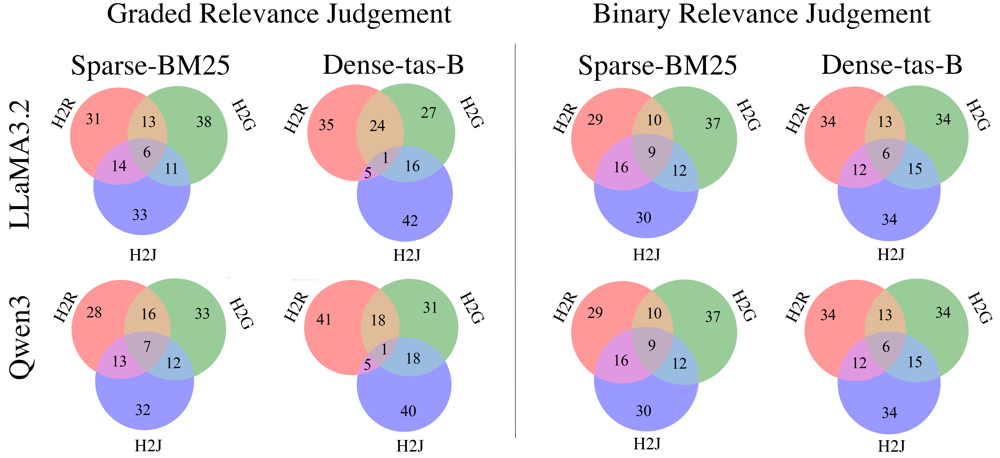

# Failing Forward: Understanding Query Failure in Retrieval, Judgment, and Generatio

This repo contains the code for the paper "Failing Forward: Understanding Query Failure in Retrieval, Judgment, and Generatio".



## Setup

```bash
pip install -r requirements.txt
```

## Hard to Retrieve

With this script we can find the hard to retrieve queries for a given run file.

```bash
python h2r_hard_queries.py \
--run_file_path hard_to_retrieve/runs/run.msmarco-v2-passage.bm25-default.dl21.txt \
--qrel_file_path datasets/qrels.dl21-passage.txt \
--quantile 0.3 \
--output hard_to_retrieve/results/h2r_hard_to_retrieve_dl21.csv
```

## Hard to Generate

With this script we can find the hard to generate queries for a given run file.

```bash
python h2g_generate_passage.py \
--queries datasets/test2021-queries-filterd.tsv \
--output h2g_generate_passage_outputs/h2g_generate_passage_dl21.json \
--model qwen3:8b
```

## Hard to Judge

With this script we can find the hard to judge queries for a given run file.


### Binary Hard to Judge
```bash
python h2j_judgement_binary.py \
--dataset [dl21, dl22] \
--model_name qwen3:8b
```
Output directory: binary_judge


### Umbrela Like Hard to Judge
```bash
python h2j_umbrela_like_llm_judge.py \
--qrel datasets/qrels.dl21-passage.txt \
--model_name qwen3:8b \
--prompt_type bing \
--base_url http://localhost:11434/v1
```

Output directroy: modified_qrels


